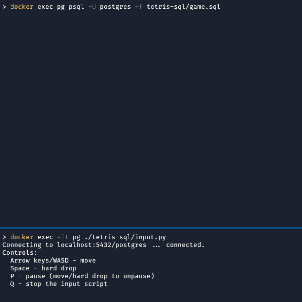

# Tetris-SQL

A complete implementation of Tetris in a SQL query.



(The initial delay is caused by Postgres optimizing the plan with JIT compilation. This can be disabled with `SET jit = off`.)

## Usage


### Installing

- Requirements:
  - A PostgreSQL server (tested with versions 10 to 17).
  - Python3 with the `psycopg2` extension installed.
  - A terminal. Tested with:
    - Windows Terminal >= v1.22 (previous versions cause the render to flicker)
    - Windows CMD
    - GNOME Terminal (tested with Ubuntu 24.04)
    - iTerm2 (MacOS)
    - Terminal (MacOS)

- Installing everything with Docker:
    - Postgres container:
    ```shell
    docker run --name pg -p 5432:5432 -d -e POSTGRES_PASSWORD=postgres postgres:16
    ```

    - Installing `psycopg2` directly in the `pg` container:
    ```shell
    docker exec pg apt update
    docker exec pg apt install -y python3-psycopg2
    ```

    - Copying the code to the container:
    ```shell
    git clone https://github.com/nuno-faria/tetris-sql
    docker cp tetris-sql pg:tetris-sql
    docker exec pg chmod +x ./tetris-sql/input.py
    ```


### Running

1. In one terminal, run the `input.py` script:
   - If using Docker:
       ```shell
       docker exec -it pg ./tetris-sql/input.py
       ```

   - If running Python locally:
       ```shell
       python3 input.py [-h] [-H HOST] [-P PORT] [-d DB] [-u USER] [-p PASSWORD]
       ```


2. In another terminal, run the Tetris query:
    ```shell
    docker exec pg psql -U postgres -f tetris-sql/game.sql
    ```

3. Switch to the input terminal to play the game.


## Implementation details

### Structure

The code is structured into two components:
   -  [game.sql](game.sql) - contains the SQL implementation of Tetris, as well as some prerequisites.
   -  [input.py](input.py) - converts user inputs into SQL commands. Details on why a separate script is needed are provided later.

### Game loop

While SQL is a powerful declarative language to query and modify data, it is not designed for general programming tasks. However, since the introduction of recursive Common Table Expressions (CTEs) in [SQL:1999](https://en.wikipedia.org/wiki/SQL:1999#Common_table_expressions_and_recursive_queries), SQL became a [Turing complete language](https://wiki.postgresql.org/wiki/Cyclic_Tag_System). Informally, this means that, in theory, we can implement "any" algorithm in it. Complex examples of recursive CTEs include the [Mandelbrot set](https://wiki.postgresql.org/wiki/Mandelbrot_set), a [3D rendering engine](https://observablehq.com/@pallada-92/sql-3d-engine), a [ray tracer](https://github.com/chunky/sqlraytracer), and even a [GPT](https://github.com/quassnoi/explain-extended-2024).

Recursive CTEs contain two terms: the *non-recursive term*, which generates the initial row of the query; and the *recursive term*, which can be executed one or more times, referring each time to the previous generated row. For example, here is a simple recursive CTE that generates numbers from 1 to 5.

```sql
WITH RECURSIVE t(i) AS (
    -- non-recursive term
    SELECT 1
    UNION ALL
    -- recursive term
    SELECT i + 1 -- takes i of the previous row and adds 1
    FROM t -- self-reference that enables recursion
    WHERE i < 5 -- when i = 5, the CTE stops
)
SELECT *
FROM t;

 i
----
  1
  2
  3
  4
  5
(5 rows)
```

Recursive CTEs are thus the main feature powering the implementation, allowing us to build a game loop. To implement a game loop for Tetris, we can write a CTE with the following structure:

```sql
WITH RECURSIVE main AS (
    -- initialize the state
    SELECT ...
    UNION ALL
    -- read input -> update state -> render game
    SELECT ...,
        -- sleep a certain amount to meet a target frame rate,
        -- otherwise the loop executes as fast as possible
        pg_sleep(...)
    FROM main, ...
    -- condition to stop the game
    WHERE NOT game_over
)
...
```


### Output

While a client such as `psql` already handles the output of a SQL query's result set, we cannot rely on it to render the game. The main reason is that, at least in Postgres, recursive CTEs only return the result once the loop completes. For instance, if we took the CTE that generates a sequence of numbers and removed the stop condition, the query would hang and not show any output, unlike an infinite loop + print in a language such as C.

Luckily, Postgres provides the ability to log information using the `RAISE NOTICE` command, which is also written to the standard output in `psql`. Thus, rendering the game is done as follows:

```sql
-- function that executes RAISE NOTICE for some string.
-- since the RAISE command is not available in regular SQL code,
-- this is the one time where a PlpgSQL function is required.
CREATE OR REPLACE FUNCTION notify(str varchar) RETURNS void AS $$
BEGIN
    RAISE NOTICE '%', str;
END
$$ LANGUAGE PLPGSQL;

WITH RECURSIVE main AS (
    SELECT ...
    UNION ALL
    SELECT ...,
        notify(...),
        ...
)
...
```

The only drawback of this approach is that it prefixes each message with `NOTICE:  `, but can be hidden away with some newlines.


### Input

Handling user input is not straight forward as SQL queries are executed server-side, meaning it is impossible to read commands directly from the query. However, since we are using a database, we can indirectly read inputs by using a table as a communication bus between the query and the user: the user adds commands to a table which are then read by the query. In addition to the command identifier, this single-row table contains a timestamp column of when it was submitted, so the game can avoid processing the same input multiple times:


```sql
CREATE TABLE Input (cmd char, ts timestamp);
```

A problem with this approach is that a query will not be able to see new writes done to a table while it is running. Even though Postgres supports `READ COMMITTED` isolation (in fact, it is the default one), these isolation semantics only apply in a transactional context, where we have multiple queries executing one after the other in the same transaction. In this case, our transaction is comprised by just a single query, which always [sees data as they were at its start](https://www.postgresql.org/docs/16/transaction-iso.html#XACT-READ-COMMITTED), as if it was executing under `SNAPSHOT` guarantees. For example, the loop always shows the initial value of `'a'` in this query:

```sql
-- initial data
INSERT INTO Input VALUES ('a', now());

-- loop
WITH RECURSIVE main AS (
    SELECT notify('')
    UNION ALL
    SELECT notify(input.cmd)
    FROM main, input
)
SELECT * FROM main;

-- another client performing writes while the loop is running
UPDATE Input SET cmd = 'b', ts = now();
UPDATE Input SET cmd = 'c', ts = now();

-- loop output
NOTICE:  a
NOTICE:  a -- after the first update
NOTICE:  a -- after the second update
```

To solve this issue, we can take advantage of the Postgres `dblink` extension, which is primarily used to query remote databases. In this case, it will be used to connect to the local database with a new snapshot, read from the input table, and make the results available to the game query. By adapting the previous example to instead use `dblink`, the game query can now read the most recent input:

```sql
-- initial data: 'a'

-- loop
WITH RECURSIVE main AS (
    -- create the connection once
    WITH conn AS (
        SELECT 'conn' as name, dblink_connect('conn', 'dbname=' || current_database())
    )
    SELECT 1 as i, notify('')
    UNION ALL
    SELECT i + 1, notify(input.cmd)
    FROM main,
        conn,
        -- query the input
        dblink(conn.name, 'SELECT * FROM Input --' || i) input(c char, ts timestamp)
)
SELECT * FROM main;

-- another client performing writes while the loop is running
UPDATE Input SET cmd = 'b', ts = now();
UPDATE Input SET cmd = 'c', ts = now();

-- loop output
NOTICE:  a
NOTICE:  b -- after the first update
NOTICE:  c -- after the second update
```

There was also the need to append the current `i` to the query. Without it, Postgres would run the query once and cache the result, as shown in the following plan excerpts:

```sql
-- without i appended
...
->  Memoize  (loops=999)
   ...
   Hits: 998  Misses: 1  ...
   ->  Function Scan on dblink input (loops=1) -- only called once
...

-- with i appended
...
->  Nested Loop  (loops=999)
   ->  WorkTable Scan on main main_1  (loops=999)
   ->  Function Scan on dblink input  (loops=999) -- called every iteration
...
```

Since writing the input update queries by hand would make the game difficult to play, the `input.py` script reads user inputs and updates the database accordingly.


### Game State and Logic


The game state is comprised by the following columns:
- `frame` - current frame id.
- `board` - array storing whether a particular game cell is filled or not.
- `score` - current score.
- `drop_delta` - gravity, or current time between each natural piece drop.
- `pos` - array storing information about the current piece's position.
- `max_drop_lines` - maximum number of lines the current piece can be dropped, used to determine game over, enabling hard drops, and rendering the ghost piece, i.e., where the current piece is going to land.
- `next_piece` - identifier of the next piece to spawn, to allow it to be previewed.
- `last_drop_time` - last time a piece moved down, to know when to apply the next drop by gravity.
- `last_input_time` - last time an input was processed, to ensure the same input is processed only once.
- `render` and `sleep` - void columns from the `notify` and `pg_sleep` functions, respectively.
- `last_frame_time` - time of the last frame, so the next sleep can use it to match the target fps.

This state is updated each frame based on the gravity or user input.

In addition to the dynamic state, there are also three static tables:
- `const` - stores constant parameters such as the board dimensions, fps, initial gravity, and so on.
- `points_per_line` - number of points awarded based on the number of lines cleared in one move.
- `tetromino` - initial coordinates for each tetromino/piece.


#### Board

The `board` is a boolean 1D array where each element refers to a Tetris cell. Each cell can either be filled (`true`) or empty (`false`). The first element of the array refers to the top-left cell, while the last refers to the bottom-right, as illustrated in the sketch below:

```
+----+----+----+----+----+----+----+----+----+----+----+
|  0 |  1 |  2 |  3 |  4 |  5 |  6 |  7 |  8 |  9 | 10 |
+----+----+----+----+----+----+----+----+----+----+----+
| 11 | 12 | 13 | 14 | 15 | 16 | 17 | 18 | 19 | 20 | 21 |
+----+----+----+----+----+----+----+----+----+----+----+
|                          ...                         |
+----+----+----+----+----+----+----+----+----+----+----+
```

A 1D array is used instead of a 2D one given 1D arrays are easier to work with in Postgres. For example, consider the following operations on 1D vs 2D arrays:

```sql
SELECT (ARRAY[1,2,3])[1]; -- postgres arrays are 1-indexed
 array
-------
     1 -- returns the first element, as expected
(1 row)

SELECT (ARRAY[[1,2,3], [4,5,6]])[1];
 array
-------
        -- returns null
(1 row)
-- to get the first element
SELECT (ARRAY[[1,2,3], [4,5,6]])[1][:];
   array
-----------
 {{1,2,3}} -- but returns a 2D array


-- unnest in a 1d array
SELECT unnest(ARRAY[1,2]);
 unnest
--------
      1
      2

-- unnest in a 2d array: flattens everything
SELECT unnest(ARRAY[[1,2], [3,4]]);
 unnest
--------
      1
      2
      3
      4
```

Apart from arrays, there is the possibility to use records, JSON/JSONB, strings, and even integers + binary arithmetic.

Considering a regular 10x20 Tetris board, the `board` array actually stores 11x20 total cells. The 11th cell in each line is always filled. Having an extra filled cell simplifies the collision detection with the edges of the board. For instance, while the player sees the board on the left, the true representation is shown on the right:


```
|                    |   |                    []|
|                    |   |                    []|
|                    |   |                    []|
|    [][]        [][]|   |    [][]        [][][]|
|  [][][][]    [][][]|   |  [][][][]    [][][][]|
|  [][][][][][][][][]|   |  [][][][][][][][][][]|
+--------------------+   +----------------------+
```

To clear lines on the board, we just need to split it into one row per level and filter out the rows that are complete. Determining complete lines is easily achieved with `WHERE NOT line <@ ARRAY[true]`, i.e., discard the lines that are contained by an array with a single true value, or, in other words, lines that only have true values. Then, the remaining lines are aggregated back into a board, with additional empty lines added at the top to match the original height. Since the 11th cell is always marked as true, it does not affect this algorithm.


#### Movement

The `pos` column stores the id of the current piece ([0, 6]), the id of the rotation ([0, 3]), the number of cells moved (0 for the initial position), and the piece status. The status is used to know when to execute additional logic. It is mostly set to 0, except when the piece dropped (1) or it is a new spawn (2). When set to 1, we must check if the current piece will become locked down, in which case we add it to the board and select the next piece. When set to 2, the next piece must be generated, since the previous one will now be played.

When a new piece `id` spawns, `pos = [id, 0, 0, 0]`. After the input is processed, or the piece falls naturally, the position is updated accordingly. For example:


```
         start                  right
     [3, 0, 0, 0]            [3, 0, 1, 0]
+--------------------+  +--------------------+
|. . . [][][]. . . . |  |. . . . [][][]. . . |
|. . . . []. . . . . |  |. . . . . []. . . . |
|. . . . . . . . . . |  |. . . . . . . . . . |

         down                 up (rotate)
     [3, 0, 12, 1]           [3, 1, 12, 0]
+--------------------+  +--------------------+
|. . . . . . . . . . |  |. . . . . []. . . . |
|. . . . [][][]. . . |  |. . . . [][]. . . . |
|. . . . . []. . . . |  |. . . . . []. . . . |

```

If the new movement causes a collision with an existing block in the board, there are two options:
- If the movement makes the piece move left, right, or rotate, the final position reverts to the previous one.
- If the movement makes the piece move down, the previous position blocks are added to the board, using a recursive CTE, and the position is updated to point to the next piece.

To determine collisions with the board, a simple join is performed between the materialized piece coordinates and the board array. If any row resulting from the join is set to true (determined using the `bool_or` aggregation function), we have a collision.


#### Hard drop / Ghost piece / Game over

Hard drops, ghost pieces, and game overs are all determined by a subquery that computes how many lines can the current piece fall. Once again, a recursive CTE is used to aid this task: the base value is set to -1 and, at each iteration, it moves the piece down by one line until it collides with an existing one or reaches the end of the board. The result of this query will be stored in the `max_drop_lines` column. If `max_drop_lines` is -1, the piece collided with a block in the board as soon as it spawned, meaning the game is over.


#### Next piece

The random generation algorithm used in this implementation is similar to the one in [NES Tetris](https://tetris.wiki/Tetris_(NES,_Nintendo)#Details). In detail, a piece is first randomly selected and, if it is different from current one, becomes the next. Otherwise, the random selection is executed again. This is biased to avoid selecting the same piece two times in a row, but can still happen with a probability of 1/49.

In SQL, this is implemented by first selecting two pieces at random, tagging them with `rank` 0 and 1. If the piece with `rank = 0` is equal to the previous one, it is discarded. Then, the query simply selects the piece with the smallest `rank`.


#### Rendering

To render the game, a subquery first creates a new temporary `char[]` of the board with the current and ghost pieces added to it. Then, the array is converted to a string, using the builtin `array_to_string` function. Finally, a pretty-print version of this string is created, e.g., `'t'` becomes `[]`, using the `replace` function. In addition to the board, the current score, level, lines cleared, and next piece are added to the final render string.


### Resource usage

At 60 FPS using Postgres 16, the query's CPU usage stays relatively low, with `docker stats` reporting around 4% of a single thread (Ryzen 5 3600).

As for memory, it appears that Postgres it not able to discard recursive CTE rows that will not be used in the final result, meaning all intermediate data are kept. The following chart plots the query's memory and disk usage for one hour (measured with `docker stats` and `du`; the base memory/disk are subtracted from the start to just measure the query's impact):


It is noticeable that the query's memory usage increases throughout the run. However, the increase is considerably slow after around minute 12. Since the default value of the [`work_mem`](https://www.postgresql.org/docs/16/runtime-config-resource.html#GUC-WORK-MEM) parameter is relatively low (4MB), Postgres will also use temporary files to store the partial results, meaning disk usage also increases continuously.

In theory, since the query only projects, in the end, the maximum score, this could be optimized to maintain, at any given time, the maximum score and the previous row. This would be useful not just for this particular case, but also for real workloads -- e.g., traversing the path in a large graph where we want to retrieve just the last node.

In practice, most runs should already be over by the time this becomes an issue. Nevertheless, even the original NES Tetris can [crash in long runs](https://arstechnica.com/gaming/2024/01/someone-has-finally-beaten-nes-tetris/), so an eventual OOM crash can be seen as a feature!
